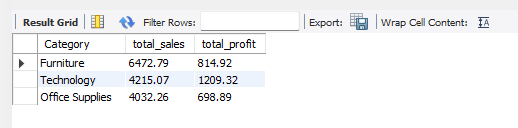
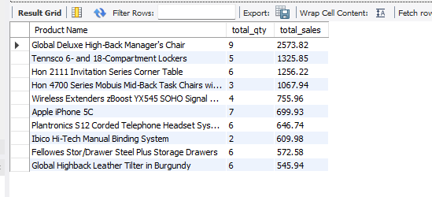
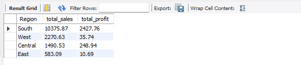
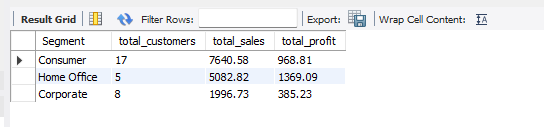
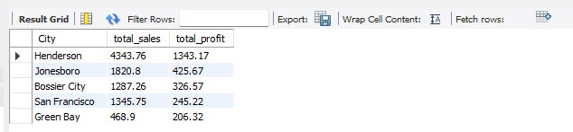
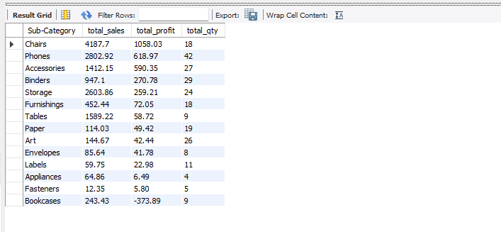
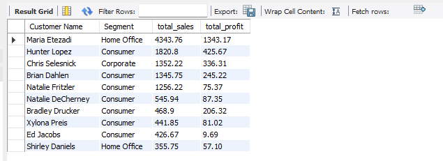

# Superstore Sales Analysis — SQL Project

This is one of my portfolio projects where I explored a retail superstore dataset using MySQL. The goal was simple: dig into the data and find out what’s actually going on with the sales, profit, and customers.

**Tools:** MySQL, MySQL Workbench  
**Dataset:** Sample Superstore (Kaggle)

-----

## What I Was Trying to Answer

- How much revenue and profit did the store make overall?
- Which product categories and sub-categories sell the most?
- Where are the most profitable regions and cities?
- Who are the top customers, and which segment performs best?

-----

## 1. Total Revenue & Profit

First things first — let’s see the overall numbers.

```sql
SELECT 
    ROUND(SUM(CAST(sales AS DECIMAL(10,2))), 2) AS total_revenue,
    ROUND(SUM(CAST(profit AS DECIMAL(10,2))), 2) AS total_profit
FROM orders;
```


Total revenue came in at **$14,720.12** with a profit of **$2,723.13** — roughly an 18.5% margin. Not bad, but there’s definitely room to improve depending on the category.

-----

## 2. Revenue per Category

```sql
SELECT 
    Category,
    ROUND(SUM(Sales), 2) AS total_sales,
    ROUND(SUM(CAST(Profit AS DECIMAL(10,2))), 2) AS total_profit
FROM orders
GROUP BY Category
ORDER BY total_sales DESC;
```



Furniture leads in sales, but Technology actually makes more profit with less revenue. That’s a sign that Technology has a better margin — worth focusing on if you want to grow profit.

-----

## 3. Top 10 Best Selling Products

```sql
SELECT 
    `Product Name`,
    SUM(Quantity) AS total_qty,
    ROUND(SUM(Sales), 2) AS total_sales
FROM orders
GROUP BY `Product Name`
ORDER BY total_sales DESC
LIMIT 10;
```



The Global Deluxe High-Back Manager’s Chair tops the list at $2,573.82. Most of the top products are furniture — which makes sense given the category numbers above.

-----

## 4. Revenue per Region

```sql
SELECT 
    Region,
    ROUND(SUM(Sales), 2) AS total_sales,
    ROUND(SUM(CAST(Profit AS DECIMAL(10,2))), 2) AS total_profit
FROM orders
GROUP BY Region
ORDER BY total_sales DESC;
```



South region is carrying most of the weight here — both in sales and profit. East is at the bottom with only $583 in sales and $10 in profit, which is a big gap compared to the others.

-----

## 5. Customer Segment Analysis

```sql
SELECT 
    Segment,
    COUNT(DISTINCT `Customer ID`) AS total_customers,
    ROUND(SUM(Sales), 2) AS total_sales,
    ROUND(SUM(CAST(Profit AS DECIMAL(10,2))), 2) AS total_profit
FROM orders
GROUP BY Segment
ORDER BY total_sales DESC;
```



Consumer has the most customers and highest sales. But Home Office — with only 5 customers — generated $1,369 in profit. That’s the highest profit per customer of any segment, which is pretty interesting.

-----

## 6. Top 5 Most Profitable Cities

```sql
SELECT 
    City,
    ROUND(SUM(Sales), 2) AS total_sales,
    ROUND(SUM(CAST(Profit AS DECIMAL(10,2))), 2) AS total_profit
FROM orders
GROUP BY City
ORDER BY total_profit DESC
LIMIT 5;
```



Henderson stands out with $1,343 in profit — more than 3x the second city. San Francisco also makes the list despite not having the highest sales, which means their orders are more efficient.

-----

## 7. Sub-Category Analysis

```sql
SELECT 
    `Sub-Category`,
    ROUND(SUM(Sales), 2) AS total_sales,
    ROUND(SUM(CAST(Profit AS DECIMAL(10,2))), 2) AS total_profit,
    SUM(Quantity) AS total_qty
FROM orders
GROUP BY `Sub-Category`
ORDER BY total_profit DESC;
```



Chairs and Phones are the most profitable sub-categories. On the other end, Bookcases recorded a **negative profit of -$373.89** — meaning the store is losing money on every bookcase sold. That’s a red flag worth investigating.

-----

## 8. Top 10 Customers by Revenue

```sql
SELECT 
    `Customer Name`,
    Segment,
    ROUND(SUM(Sales), 2) AS total_sales,
    ROUND(SUM(CAST(Profit AS DECIMAL(10,2))), 2) AS total_profit
FROM orders
GROUP BY `Customer Name`, Segment
ORDER BY total_sales DESC
LIMIT 10;
```



Maria Etezadi is the top customer by a wide margin — $4,343 in sales and $1,343 in profit, all from the Home Office segment. Most of the top 10 are Consumer segment customers.

-----

## What I Found

A few things stood out to me after going through the data:

- Technology has the best profit margin even though Furniture sells more
- Bookcases are losing money — needs a pricing review
- Home Office customers are small in number but highly profitable
- East region is underperforming compared to others
- A handful of customers drive a significant chunk of the revenue

-----

